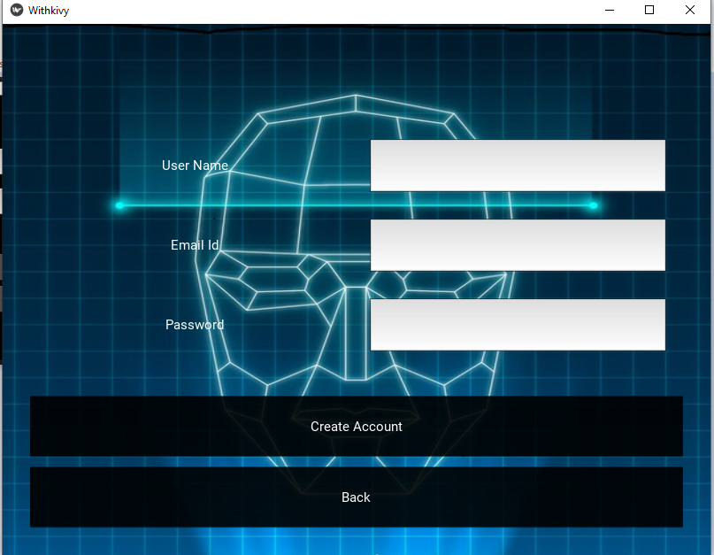
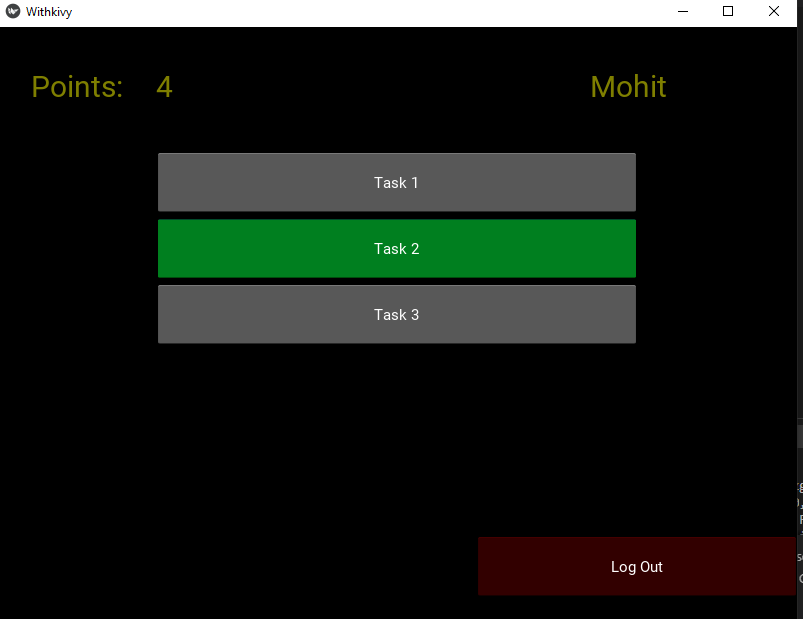
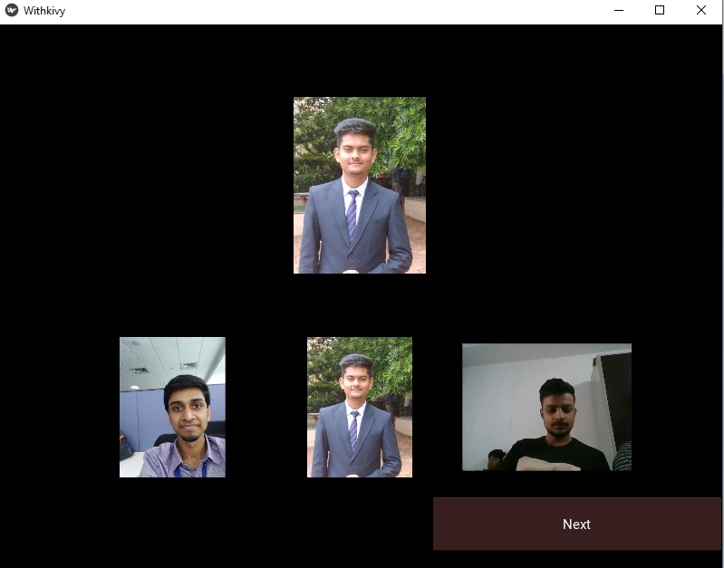
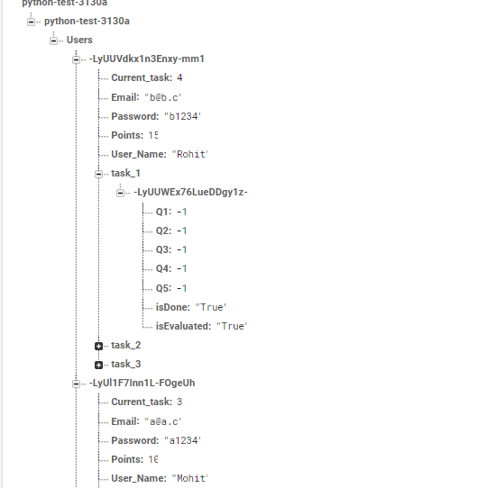

# ESP-GAME
Esp game
To run this project you need to satisfy following requirements:\n
1. Python3
2. Kivy 1.11.1
3. Firebase\n
Please ensure all the imports and assure that all imports are present or kindly install them(mostly by pip isntall xyz)
To run this project simply download/clone the Project folder from the repo.
After that simply run Esp.py file (python Esp.py)
For this project I have following Assumptions:
1. Images to be shown in problem are stored locally(it can also be stored on the firebase/server) in a folder named  Tasks in the following fashion:\n
 Tasks/Task1/Q1...Q5'  and  Q1 also contain 4 images (1 primary and 3 secondary)
 Tasks/Task2/Q1...Q5'  and  Q1 also contain 4 images (1 primary and 3 secondary) 
 
 
 
 2. At the time of login or creating accound Internet is required. After signing in Internet is not required i.e Player will be able to play and complete tasks whether Internet is available or not. 
 
The user's response is saved in both firebase and on local file system. Whenever a user creats account his/her data is saved in folders named 'data' and 'AllUsers' (These folders are created at run time).
 
The files for now are not encrypted but for adding security we can add encryption to the files.

3. For getting score for any or all submited task user is required to log out and log in. As only on login Internet is required so above step is required in order to push user's response to server and match it with other user's response and evaluate.

4.For now only three task (Each task have 5 primary questions/images) is considered. It can be varied according to the requirement.

5.This game works fine for N number of users.
6. Each users gets only one chance to perform one task.
At a time only one task is unlocked(That is green colored) and rest are locked. Other tasks are unlock sequentially as the users progresses.

In firebase I have followed following hierarchy:
              Users(root)--->User(1)--->{user_name, emailid, password, current_task_performing, points, task1{}, task2{},....taskn{})
              
              
 Flow of project:
 
 1. signin/create acoount (Proper validation and authentication) at the time of sign in online and offline databases are synced.
 
 
 2. Dashboard displayes user name 
 
 
 
 3. Task problems                                
   
 
 4. Firebase Architecture
 
 
 
 
 
                  

